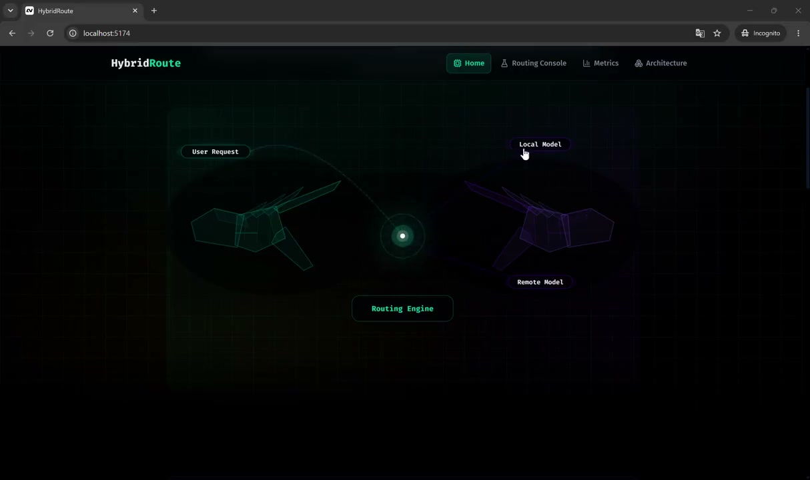

# HybridRoute

**What it does:** classifies each prompt by workload, answers easy work on a **local** model (Ollama), and escalates hard or high-risk work to a **hosted** Fireworks model. A React demo UI shows the reply in the same chat thread, plus route (Local/Hosted), model name, runtime, and remote tokens used.

**Why it exists:** cut remote token cost and latency on simple tasks while keeping stronger models available when quality matters.

## Demo

> GitHub README cannot embed a raw `.mp4` player (it only offers a download link).  
> Use the hosted player below — the video streams in your browser.

**[▶ Play demo](https://est4ever.github.io/HybridRoute/)**

[](https://est4ever.github.io/HybridRoute/)

If the link is not live yet, open [`docs/index.html`](./docs/index.html) after enabling GitHub Pages, or run the `Deploy demo pages` workflow.

## Repository layout

| Path | Purpose |
|------|---------|
| `hybridroute-track1/` | **Judged** Docker batch agent (`docker.io/jesse0724/hybridroute-track1:latest`) |
| `hybrid-routing-agent/` | Local-first router (scoring, Ollama, verifier, Fireworks) |
| `backend-api/` | FastAPI bridge: `POST /api/route` → router |
| `UI/` | React/Vite ChatGPT-style demo |
| `docs/` | Demo video + browser player (`index.html`) |
| `RUN-DEMO.md` | Short “already set up” checklist |

---

## How routing works

```text
Prompt
  │
  ▼
Pre-flight workload score (text only, no model call)
  │
  ├─ score 0–35   → Local only (Ollama)
  ├─ score 36–60  → Local first + verifier
  │                   └─ escalate to Fireworks only if verification fails
  │                      and escalation signals are strong enough
  └─ score 61–100 → Compress prompt → Fireworks (hosted)
```

Additional rules:

- **Hard-locked local** task types never escalate: classification, extraction, rewriting.
- **High-risk keywords** (legal, medical, PII, etc.) bias toward hosted models.
- If Fireworks fails, the demo path can fall back to the best local answer.
- The UI shows under each assistant reply: **Local/Hosted · model · ms · remote tokens** (and tokens saved when > 0).

More detail: [hybrid-routing-agent/README.md](./hybrid-routing-agent/README.md).

---

## Setup after cloning

### Prerequisites

- Git, **Python 3.11+**, **Node 18+**
- [Ollama](https://ollama.com/) installed and running
- A [Fireworks](https://fireworks.ai/) account and API key

### 1. Clone

```powershell
git clone <your-repo-url> HybridRoute
cd HybridRoute
```

### 2. Pull a local model

```powershell
ollama pull gemma3:1b
```

### 3. Add your API key

```powershell
cd hybrid-routing-agent
copy .env.example .env
```

Open `hybrid-routing-agent/.env` and set at least:

```env
FIREWORKS_API_KEY=fw_your_real_key_here
FIREWORKS_BASE_URL=https://api.fireworks.ai/inference/v1
FIREWORKS_MODEL=accounts/fireworks/models/minimax-m3
LOCAL_MODEL_PROVIDER=ollama
LOCAL_MODEL_NAME=gemma3:1b
```

| Variable | Meaning |
|----------|---------|
| `FIREWORKS_API_KEY` | Your Fireworks secret (required for hosted routes) |
| `FIREWORKS_BASE_URL` | Fireworks OpenAI-compatible API base |
| `FIREWORKS_MODEL` | Hosted model id (must be one you can call) |
| `LOCAL_MODEL_PROVIDER` | `ollama` for real local inference, or `placeholder` without Ollama |
| `LOCAL_MODEL_NAME` | Ollama model tag (e.g. `gemma3:1b`) |

**Never commit `.env`.** Only `.env.example` is in git.

### 4. Install Python deps

```powershell
cd hybrid-routing-agent
python -m venv venv
.\venv\Scripts\pip install -r requirements.txt
.\venv\Scripts\pip install -r ..\backend-api\requirements.txt
```

### 5. Start the API (port 8002)

```powershell
cd ..\backend-api
..\hybrid-routing-agent\venv\Scripts\python.exe -m uvicorn app:app --host 127.0.0.1 --port 8002
```

Health check: http://127.0.0.1:8002/ → `{"status":"ok",...}`

### 6. Start the UI (second terminal)

```powershell
cd UI
npm install
npm run dev
```

Open http://localhost:5173/demo and send a prompt.

- Simple: e.g. `What is 2+2?` → expect **Local** / `gemma3:1b`
- Hard: a long design/proof-style prompt → expect **Hosted** / your Fireworks model

Optional: point the UI at another API host with `VITE_API_BASE_URL` (see `UI/src/constants/config.ts`).

---

## Track 1 (judged Docker agent)

Hackathon scoring uses the Docker agent only — not the React UI:

```bash
docker pull docker.io/jesse0724/hybridroute-track1:latest
```

The harness injects `FIREWORKS_API_KEY`, `FIREWORKS_BASE_URL`, and `ALLOWED_MODELS`. See [hybridroute-track1/README.md](./hybridroute-track1/README.md).

---

## Public / hosted demo

A static UI host alone is not enough — the API needs a server and `FIREWORKS_API_KEY`.

1. Deploy `backend-api` + `hybrid-routing-agent` (Railway / Render / Fly).
2. Set the same env vars as in `.env` on that host.
3. Without Ollama in the cloud, use `LOCAL_MODEL_PROVIDER=placeholder`.
4. Deploy `UI/` with `VITE_API_BASE_URL=https://your-api.example.com`.
5. Do **not** put API keys in the frontend.

For hackathon presentation, a local laptop demo is usually best.

---

## Security

- Keep secrets only in `hybrid-routing-agent/.env`.
- If a key was ever committed or pasted in chat, **rotate it** in the Fireworks console.
